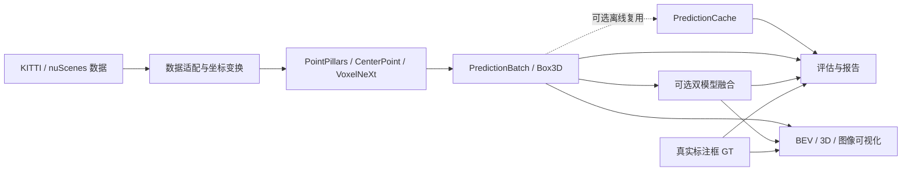

# LiDAR 三维目标检测与评估系统

[](https://github.com/LiuKaiDev/lidar-3d-perception/actions/workflows/cpu-tests.yml)

这是一个基于 Python、PyTorch 和 OpenPCDet 的激光雷达三维目标检测与评估项目。它可以读取 KITTI 与 nuScenes 数据，将 nuScenes 多帧点云对齐到当前 LiDAR 坐标系，运行 PointPillars、CenterPoint 或 VoxelNeXt，并将不同检测器的输出转换为统一格式。项目还提供检测结果融合、官方 nuScenes 评估、按距离和目标点数分组的分析、错误案例筛选、可视化、性能测试和自动化测试。

项目默认使用 VoxelNeXt 处理 nuScenes；CenterPoint 用于基线对比。两者的网络结构、预训练权重和 CUDA 算子来自固定版本的 OpenPCDet，本仓库实现数据适配、几何运算、统一接口、评估分析和命令行工具。

## 核心能力

- **KITTI 与 nuScenes 数据读取**：解析点云、真实标注框（GT）、标定参数和传感器位姿，将不同数据集转换为统一的 LiDAR 坐标约定。
- **nuScenes 多帧点云**：沿 `sample_data`、`calibrated_sensor` 和 `ego_pose` 关系读取历史多帧点云（sweeps），变换到当前 `LIDAR_TOP` 坐标系后再拼接，并保留时间差。
- **三种检测器接入**：支持 KITTI PointPillars，以及 nuScenes CenterPoint-PointPillar 和 VoxelNeXt；配置、checkpoint 来源和类别映射均由 YAML 管理。
- **统一预测格式**：所有检测器输出 `PredictionBatch`，每个目标包含类别、置信度、三维中心、长宽高、朝向、速度和可选跟踪 ID，便于替换模型或复用下游工具。
- **双模型检测结果融合**：依次运行 CenterPoint 与 VoxelNeXt，关联同类别且位置接近的框，合并重复预测并保留两种模型各自发现的候选目标。
- **检测效果分析**：既支持 nuScenes 官方 mAP/NDS，也支持按目标距离、GT 框内当前帧点数和类别统计召回率、精确率、误检、漏检和定位误差。
- **错误案例与可视化**：筛选远距离漏检、低点数漏检、高置信度误检和定位偏差案例，可绘制 KITTI 图像投影、鸟瞰图（BEV）和三维框。
- **性能与复现工具**：测量模型计算和完整推理流程耗时，校验 checkpoint SHA-256，缓存带配置来源记录的预测，并通过 CPU CI 检查核心几何、匹配、融合和报告生成。

## 系统架构



数据适配层负责加载点云和标定信息，并把输入转换到参考 LiDAR 坐标系。检测器只接收点云，不使用 GT；GT 仅在评估、错误分析和可视化时读取。OpenPCDet 提供网络与底层 CUDA 算子，`lidar_perception/detection/openpcdet_backend.py` 负责模型生命周期和输出转换。

`PredictionCache` 是带来源记录的预测缓存，用于避免离线评估重复运行检测器；它通过数据集、划分、sweep 数、配置 hash、checkpoint hash 和输出格式版本防止误用旧预测。单样本推理和实时双模型融合不依赖缓存，可以直接处理内存中的 `PredictionBatch`。

## 输入、坐标与输出

### 输入

- KITTI Velodyne 点云：float32 `[x, y, z, intensity]`。
- nuScenes 点云：当前帧与历史 sweeps 对齐后的 `[x, y, z, intensity, time_lag]`。
- 标定和位姿：KITTI 的 `Tr_velo_to_cam`、`R0_rect`、`P2`，或 nuScenes 的 sensor-to-ego 与 ego-to-global 变换。
- 可选 GT：只供评估和可视化，不是检测器输入。

项目内部统一采用 LiDAR 坐标系：`x` 向前、`y` 向左、`z` 向上；三维框中心为几何中心，尺寸顺序固定为 `[length, width, height]`，`yaw` 是绕 `+z` 轴的右手系旋转。

### 单样本输出

`tools/demo_nuscenes.py` 默认写入 `outputs/demo/<detector>/<sample-token>.json`。根节点包含 `prediction`、`summary` 和 `timing`；真正的统一预测位于 `prediction` 字段：

```json
{
  "schema_version": "lidar_perception.demo_nuscenes.v1",
  "sample_token": "<token>",
  "detector": "voxelnext",
  "prediction": {
    "frame_id": "<token>",
    "runtime_ms": 84.5,
    "boxes": [
      {
        "label": "car",
        "score": 0.91,
        "center": [12.3, -4.1, 0.7],
        "size": [4.2, 1.8, 1.6],
        "yaw": 0.12,
        "velocity": [2.1, 0.0, 0.0],
        "track_id": null
      }
    ],
    "metadata": {}
  },
  "summary": {"prediction_count": 1},
  "timing": {}
}
```

上面的数值仅用于说明格式，不是实测输出。读取检测框：

```python
import json
from pathlib import Path

result = json.loads(Path("outputs/demo/voxelnext/<token>.json").read_text())
for box in result["prediction"]["boxes"]:
    print(box["label"], box["score"], box["center"], box["size"], box["velocity"])
```

## 安装

### 1. 克隆仓库

```bash
git clone https://github.com/LiuKaiDev/lidar-3d-perception.git
cd lidar-3d-perception
```

CPU 检查和 GPU 推理是两套环境选择。不要在准备好的 CUDA 环境里执行 CPU Torch 安装命令，否则会覆盖 CUDA 版 Torch。

### 2A. 无 GPU 的 CPU 检查

这条路径不需要数据集、checkpoint、CUDA 或 OpenPCDet checkout：

```bash
python3.12 -m venv .venv
.venv/bin/python -m pip install -e '.[ci]'
.venv/bin/python -m pip install torch==2.5.1+cpu --index-url https://download.pytorch.org/whl/cpu

PYTHONPATH=. .venv/bin/python tools/validate_environment.py --profile cpu
PYTHONPATH=. .venv/bin/python tools/demo_nuscenes.py --help
make cpu-tests
```

### 2B. GPU 推理环境

已验证环境为 Ubuntu 24.04/WSL2、Python 3.12.3、RTX 2060 6GB、PyTorch `2.5.1+cu124`、CUDA 12.4 运行时、spconv `2.3.8` 和 nuScenes devkit `1.2.0`。建议使用独立虚拟环境：

```bash
git submodule update --init third_party/OpenPCDet

python3.12 -m venv .venv-gpu
GPU_PYTHON=.venv-gpu/bin/python
$GPU_PYTHON -m pip install --upgrade pip setuptools wheel
$GPU_PYTHON -m pip install -e '.[ci]'
$GPU_PYTHON -m pip install torch==2.5.1+cu124 torchvision==0.20.1+cu124 \
  --index-url https://download.pytorch.org/whl/cu124
$GPU_PYTHON -m pip install spconv-cu124==2.3.8 cumm-cu124==0.7.11 \
  nuscenes-devkit==1.2.0
$GPU_PYTHON -m pip install -r third_party/OpenPCDet/requirements.txt
```

OpenPCDet 还需要针对本机 CUDA Toolkit 和 GPU 架构编译扩展。下面是通用调用方式；`CUDA_HOME` 必须指向包含 `nvcc` 的 Toolkit，RTX 2060 使用 `TORCH_CUDA_ARCH_LIST=7.5`：

```bash
CUDA_HOME=<cuda-toolkit-path> TORCH_CUDA_ARCH_LIST=7.5 MAX_JOBS=1 \
  $GPU_PYTHON -m pip install -e third_party/OpenPCDet \
  --no-build-isolation --no-deps
```

本项目验证环境还需要 GCC 12 和特定的 CUDA include 路径。完整的固定版本、wheel hash 和实际编译命令记录在 [环境说明](docs/environment.md) 与 [环境快照](docs/environment.lock.md) 中。

## 数据、权重与单样本推理

nuScenes 数据根目录应包含 `v1.0-mini/` 和对应 `samples/`、`sweeps/`。checkpoint 不进入仓库，其来源和 SHA-256 记录在 `configs/detectors/`。可以使用命令参数指定路径：

```bash
GPU_PYTHON=.venv-gpu/bin/python

PYTHONPATH=. $GPU_PYTHON tools/validate_environment.py --profile gpu
PYTHONPATH=. $GPU_PYTHON tools/validate_assets.py \
  --detector voxelnext \
  --dataset-root <nuscenes-root> \
  --checkpoint <voxelnext-checkpoint>
```

不指定 `--detector` 时使用 VoxelNeXt：

```bash
# VoxelNeXt
PYTHONPATH=. $GPU_PYTHON tools/demo_nuscenes.py \
  --dataset-root <nuscenes-root> \
  --checkpoint <voxelnext-checkpoint> \
  --sample-token <token>

# CenterPoint
PYTHONPATH=. $GPU_PYTHON tools/demo_nuscenes.py \
  --detector centerpoint \
  --dataset-root <nuscenes-root> \
  --checkpoint <centerpoint-checkpoint> \
  --sample-token <token>

# CenterPoint + VoxelNeXt 双模型融合
PYTHONPATH=. $GPU_PYTHON tools/demo_nuscenes.py \
  --detector e3 \
  --dataset-root <nuscenes-root> \
  --sample-token <token>
```

`e3` 是双模型融合模式的命令行标识。该模式从两个检测器 YAML 读取 checkpoint 路径，不接受 `--checkpoint` 覆盖；运行前可用 `tools/validate_assets.py --detector e3` 检查两份权重。首次模型加载和稀疏算子初始化可能明显慢于后续推理。

## 可视化

KITTI 可视化支持 `bev`、`3d` 和相机图像投影：

```bash
PYTHONPATH=. .venv-gpu/bin/python tools/visualize.py \
  --config configs/datasets/kitti.yaml \
  --dataset-root <kitti-root> \
  --frame-id 004139 \
  --view bev \
  --output outputs/kitti_004139_bev.png
```

nuScenes 的可视化工具读取根节点为 `PredictionBatch` 的 JSON。下面的命令先用显式 VoxelNeXt 配置导出该格式，再绘制 GT 与预测框：

```bash
PYTHONPATH=. .venv-gpu/bin/python tools/infer_nuscenes.py \
  --config configs/detectors/voxelnext/nuscenes_mini.yaml \
  --dataset-root <nuscenes-root> \
  --checkpoint <voxelnext-checkpoint> \
  --sample-token <token> \
  --output outputs/voxelnext/predictions/<token>.json

PYTHONPATH=. .venv-gpu/bin/python tools/visualize_nuscenes.py \
  --config configs/detectors/voxelnext/nuscenes_mini.yaml \
  --dataset-root <nuscenes-root> \
  --sample-token <token> \
  --predictions-dir outputs/voxelnext/predictions \
  --output-dir outputs/voxelnext/visualizations \
  --view bev
```

`demo_nuscenes.py` 的 JSON 多一层 `prediction` 包装，不能直接作为 `visualize_nuscenes.py` 的输入。本 README 不把这两个不同格式的入口混接。
上述 BEV 命令保存 `outputs/voxelnext/visualizations/<token>_gt_pred_bev.png`；将 `--view` 改为 `3d` 可输出三维视图。

## CenterPoint + VoxelNeXt 双模型融合

双模型模式为同一个 sample 依次运行 CenterPoint 和 VoxelNeXt。为适应 6GB GPU，程序在加载 VoxelNeXt 前释放 CenterPoint backend。融合只读取预测框，不使用 GT：

1. 按类别和 XY 中心距离关联两个模型的预测，当前阈值为 `0.5 m`，每个框最多匹配一次。
2. CenterPoint 置信度乘以 `1.2`，VoxelNeXt 权重为 `1.0`；匹配框使用概率 OR 公式合并置信度。
3. 几何、yaw 和速度取调整后置信度更高的来源，避免插值产生无效框。
4. 保留置信度不低于 `0.1` 的未匹配候选，确定性排序后最多输出 500 个框。

两个模型在远距离和低点数目标上存在互补检测，因此融合可以找回部分单模型漏检；同时，保留更多候选也会增加误检。使用 `--detector e3` 即可运行该模式。

## 评估方法

项目提供两类指标：

- **官方 nuScenes 指标**：通过 `detection_cvpr_2019` evaluator 计算 mAP、NDS 和定位、尺度、朝向、速度、属性误差。
- **分组分析指标**：使用 `2.0 m` 阈值进行同类别一对一中心距离匹配。距离召回率按 GT 中心距离分组；点数召回率按 GT 框内当前 keyframe LiDAR 点数分组，同时统计 precision、FP、FN 和中心定位误差。

代表性命令：

```bash
# 运行 VoxelNeXt 检测器并评估完整 mini_val，耗时较长
PYTHONPATH=. .venv-gpu/bin/python tools/evaluate_nuscenes.py \
  --config configs/detectors/voxelnext/nuscenes_mini.yaml \
  --dataset-root <nuscenes-root> \
  --checkpoint <voxelnext-checkpoint> \
  --output-dir outputs/voxelnext/evaluation

# 使用已有 CenterPoint 预测缓存做距离/点数分析；缺失缓存时直接失败
PYTHONPATH=. .venv-gpu/bin/python tools/analyze_phase4.py \
  --config configs/analysis/phase4_nuscenes.yaml \
  --no-inference

# 运行同协议性能测试；会加载并执行检测器
PYTHONPATH=. .venv-gpu/bin/python tools/benchmark_phase5.py \
  --config configs/benchmark/phase5_nuscenes.yaml

# 只读取已提交的融合与重复验证结果，检查摘要是否与 JSON 一致
PYTHONPATH=. .venv/bin/python tools/generate_phase6_summary.py --check
```

## 检测结果

以下结果来自 `nuScenes v1.0-mini` 的 `mini_val`，共 81 个样本、2 个场景；该划分也用于开发验证。mAP 和 NDS 来自官方 evaluator，分组召回率和精确率来自同一批预测上的 2 m 中心距离匹配。

| 方法 | mAP | NDS | 50 m 以上召回率 | 0–5 点目标召回率 | 精确率 | 误检数 |
|---|---:|---:|---:|---:|---:|---:|
| CenterPoint | 0.4371 | 0.4919 | 14.00% | 63.30% | 21.76% | 12,841 |
| VoxelNeXt | 0.5209 | 0.5442 | 23.40% | 68.71% | 27.95% | 9,591 |
| CenterPoint + VoxelNeXt | 0.4996 | 0.5210 | 24.60% | 71.17% | 16.13% | 19,678 |

mAP、NDS 反映整体检测质量；50 m 以上和 0–5 点目标召回率用于观察远距离、低可观测目标。双模型融合将 50 m 以上目标召回率从 VoxelNeXt 的 23.40% 提高到 24.60%，0–5 点目标召回率从 68.71% 提高到 71.17%，同时误检数由 9,591 增至 19,678，mAP 从 0.5209 降至 0.4996。

下图来自同一组已提交实验记录。图例中的 E3 表示 CenterPoint + VoxelNeXt 双模型融合。


完整四方法表、官方指标图和双模型互补性分析见 [结果摘要](reports/phase6_summary.md)。

## 性能测试

下表来自同一 RTX 2060 6GB 环境，batch size 1、FP32、20 次预热和 100 次测量。模型计算耗时使用 CUDA Events；推理流程耗时包含 CPU 点云预处理/voxelization、host-to-device、网络、decode/NMS 和 `PredictionBatch` 转换。两列都不包含原始点云文件读取和 10-sweep 组装。

| 模型 | 模型计算平均耗时 | 推理流程平均耗时 | 推理流程 P95 | batch-1 FPS |
|---|---:|---:|---:|---:|
| CenterPoint | 59.76 ms | 70.24 ms | 77.62 ms | 14.24 |
| VoxelNeXt | 84.79 ms | 111.69 ms | 131.07 ms | 8.95 |

双模型融合的顺序耗时估算未混入该表，详见 [结果摘要](reports/phase6_summary.md)。

## 测试

无数据、无 GPU 的核心测试：

```bash
make cpu-tests
```

完整测试还会读取本机已有的 KITTI/nuScenes fixture 和已编译环境：

```bash
PYTHONPATH=. .venv/bin/python -m pytest -q
```

测试覆盖三维框几何与坐标变换、预测 JSON 往返、匹配、bootstrap、缓存来源校验、双模型融合、配置解析、文档链接和结果摘要一致性。GitHub Actions 使用 Python 3.12 运行无需外部资产的 CPU 子集。

## 文档与源码入口

- [快速使用与环境](docs/quickstart.md)
- [系统架构](docs/architecture.md)
- [数据与几何约定](docs/data_and_geometry.md)
- [评估方法](docs/evaluation.md)
- [第三方代码与资产](docs/third_party.md)
- [原始实验记录](experiments/README.md)

## 许可证与第三方来源

本项目原创代码和文档采用 [Apache License 2.0](LICENSE)。PointPillars、CenterPoint、VoxelNeXt 的网络实现和 CUDA 算子来自 [OpenPCDet](https://github.com/open-mmlab/OpenPCDet)，子模块保留其自身的 Apache-2.0 LICENSE 和版权声明。KITTI、nuScenes、预训练 checkpoint、PyTorch、spconv 和其他依赖遵循各自来源条款，不由本项目许可证重新授权，也不随本仓库分发数据或模型权重。
