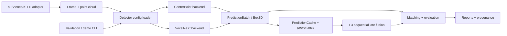

# System Architecture

The project separates project-owned evaluation and reproducibility code from
the third-party detector implementation.

## Ownership and data flow

- **Dataset adapters** (`lidar_perception/datasets`) load sensor metadata,
  point clouds, calibration, and optional ground truth. The nuScenes adapter
  assembles sweeps in the LiDAR frame; GT is consumed only by evaluation and
  analysis.
- **Config loading and validation** (`tools/phase7_common.py`, detector YAML)
  resolve paths, checkpoint identities, dataset versions, and frozen settings.
- **Backends** (`lidar_perception/detection/openpcdet_backend.py`) are the
  project boundary around CenterPoint and VoxelNeXt. Network code and CUDA ops
  come from the pinned OpenPCDet submodule; no OpenPCDet source is copied or
  modified here.
- **Schemas** (`Box3D`, `PredictionBatch`) are project-owned, serializable
  contracts. They preserve class, score, center, size, yaw, velocity, frame ID,
  and runtime/provenance metadata independent of backend tensor formats.
- **PredictionCache** stores one schema payload per sample together with dataset,
  split, sweeps, config/checkpoint hashes, threshold, and schema version. The
  single-sample demo writes the same kind of payload, but does not require or
  populate the full experiment cache.
- **Matching and evaluation** implement class-aware one-to-one center matching,
  distance/density slices, paired scene bootstrap, and official nuScenes JSON
  conversion. GT enters at these evaluation boundaries only.
- **E3 late fusion** loads the frozen E3 config, runs CenterPoint and VoxelNeXt
  sequentially (releasing the first backend before loading the second), then
  fuses prediction-only `PredictionBatch` objects. It does not use GT or retune
  on `mini_val`.
- **Reports/provenance** consume committed JSON artifacts and record protocol,
  hashes, classifications, limitations, and timing semantics. The Phase 6
  summary is generated deterministically by `tools/generate_phase6_summary.py`.
- **Validation and demo CLIs** are read-only checks plus an explicit sample
  output. Argument parsing and config validation are lazy with respect to heavy
  Torch/OpenPCDet imports, allowing CPU CI to test the boundary without model
  initialization.

## Runtime fields

`PredictionBatch.runtime_ms` is synchronized detector forward/decode/NMS time
reported by the backend. It is not process startup, dataset loading, model
loading, or full CLI wall time. Demo JSON records those scopes separately.
The Phase 5 benchmark's detector E2E scope includes preprocessing, transfer,
inference, and schema conversion. E3's 240.90 ms/sample figure is an estimated
sequential sum plus measured cached-prediction CPU fusion, not a fresh end-to-end
measurement.
