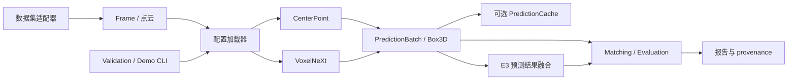

# 系统架构

## 模块边界

- `lidar_perception/datasets` 读取 KITTI 或 nuScenes 传感器记录，并将
  多帧点云转换到参考 LiDAR 坐标系。
- `tools/phase7_common.py` 和 detector YAML 负责路径、版本、checkpoint
  hash 与冻结配置解析。
- `lidar_perception/detection/openpcdet_backend.py` 是项目与 OpenPCDet 的
  边界。CenterPoint、VoxelNeXt 网络和 CUDA 算子来自固定 revision 的
  第三方子模块，项目不修改其源码。
- `Box3D` 与 `PredictionBatch` 是项目拥有的稳定输出协议，保存类别、
  score、中心、尺寸、yaw、速度、frame ID 和 runtime/provenance。
- `PredictionCache` 为离线实验保存带 dataset、split、sweeps、配置/模型
  hash 的预测。单样本 demo 可以直接输出 `PredictionBatch`，不必先写完整
  cache。
- matching、距离/密度评估、bootstrap 和官方 nuScenes 转换位于项目代码。
  GT 只在 evaluation 和离线分析边界使用，推理入口不接收 GT。
- E3 使用冻结配置顺序运行两个 detector，然后对预测结果做 late fusion；
  它不从 `mini_val` 调参。实时 demo 直接融合内存中的两个
  `PredictionBatch`，离线 cache 是可选路径。

## 计时语义

`PredictionBatch.runtime_ms` 是 backend 同步的 forward/decode/NMS 时间，
不包括进程启动、模型加载、数据读取或完整 CLI wall time。Phase 5 的
detector E2E 测量包含预处理、传输、推理和 schema 转换；E3 的
`240.90 ms/sample` 是顺序 detector 测量加缓存预测 CPU fusion 的估算；
demo JSON 另记录 frame/model load 和 CLI wall time。
