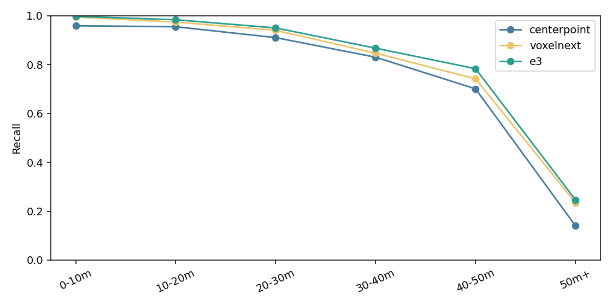
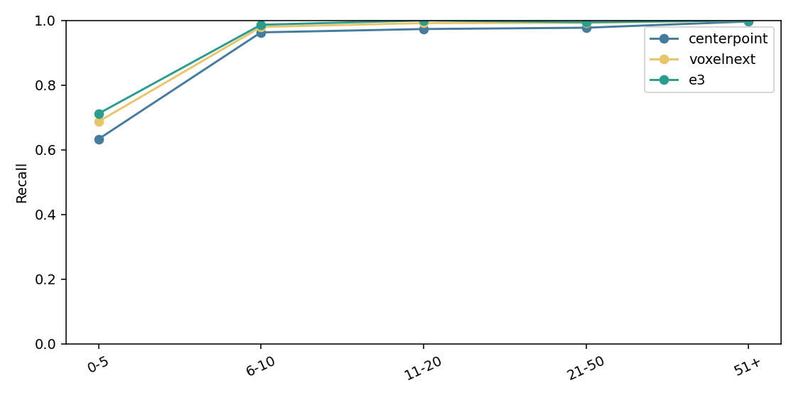
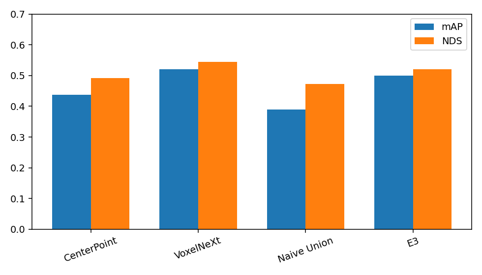
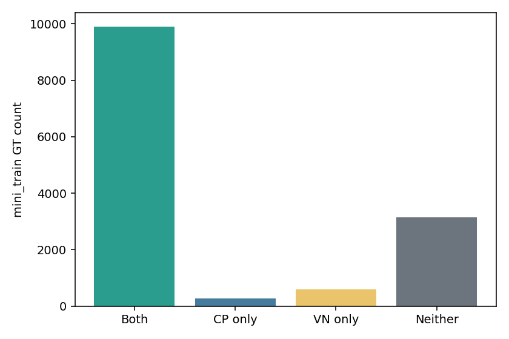

# Phase 6 Results Summary

This report is generated from the committed E3/E4 machine-readable artifacts;
run `PYTHONPATH=. .venv/bin/python tools/generate_phase6_summary.py --check`
to detect drift. It describes the **nuScenes v1.0-mini exploratory experiment**
only: `mini_val` has 81 samples from two scenes, was previously exposed, and
these results do not represent full-nuScenes generalization or a SOTA claim.

## Confirmatory mini-val results

Custom metrics use class-aware one-to-one center matching at 2 m. Recall bins
are defined by GT range or predicted point count as documented in the Phase 6
protocol. Official columns are from the nuScenes detection evaluator.

| Variant | 50m+ recall | 0-5 points recall | Overall recall | Precision | FP | mAP | NDS | Runtime |
| --- | ---: | ---: | ---: | ---: | ---: | ---: | ---: | --- |
| CenterPoint | 14.00% | 63.30% | 80.41% | 21.76% | 12,841 | 0.4371 | 0.4919 | 70.24 ms* |
| VoxelNeXt | 23.40% | 68.71% | 83.79% | 27.95% | 9,591 | 0.5209 | 0.5442 | 111.69 ms* |
| Naive Union | 24.60% | 71.39% | 85.39% | 12.77% | 25,891 | 0.3900 | 0.4726 | N/A |
| E3 late fusion | 24.60% | 71.17% | 85.23% | 16.13% | 19,678 | 0.4996 | 0.5210 | 240.90 ms est. |

E3 is the frozen sequential late-fusion ablation. It raises long-range and
sparse recall relative to either detector, but its false-positive count and
lower precision are material costs. Naive Union is retained only as a
high-recall, high-FP comparison.

## Runtime semantics

- CenterPoint and VoxelNeXt single-detector reference values are historical
  Phase 5 detector E2E measurements: 70.24 ms/sample and
  111.69 ms/sample,
  respectively. They include preprocessing, transfer, inference, and schema
  conversion under the Phase 5 scope.
- E3's **240.90 ms/sample** is an *estimated* sequential total from
  those two detector references plus measured cached-prediction CPU fusion.
  It is not a newly measured end-to-end detector latency.
- Phase 7A VoxelNeXt demo timings (about 785 s cold CLI wall time and 41.4 s
  warm CLI wall time) include process/model startup and asset I/O. They must
  not be mixed with detector E2E benchmark columns.
- E4 repeat validation status is **PASS** for both custom and official
  metrics; it repeats frozen cached-prediction evaluation and does not retune.

## Recommendation

Use **VoxelNeXt** as the default model because it has the strongest official
mini-val mAP/NDS and the best precision among the compared variants. Keep
**CenterPoint** as the baseline, **E3** as a directional complementarity
ablation, and **Naive Union** only as a diagnostic control.

## Source artifacts and figures

- [`experiments/e3_late_fusion/metrics.json`](../experiments/e3_late_fusion/metrics.json)
- [`experiments/e4_repeat_validation/metrics.json`](../experiments/e4_repeat_validation/metrics.json)
- [`experiments/e3_late_fusion/benchmark.json`](../experiments/e3_late_fusion/benchmark.json)

Distance recall shows where complementarity is concentrated, including the
small 50m+ E3 gain over VoxelNeXt.

Density recall exposes the sparse 0-5-point slice rather than hiding it inside
the overall score.

Official metrics show why VoxelNeXt remains the default despite E3's custom
recall gains.

Complementarity separates shared detections from model-only recoveries and
provides the rationale for retaining E3 as an ablation.

